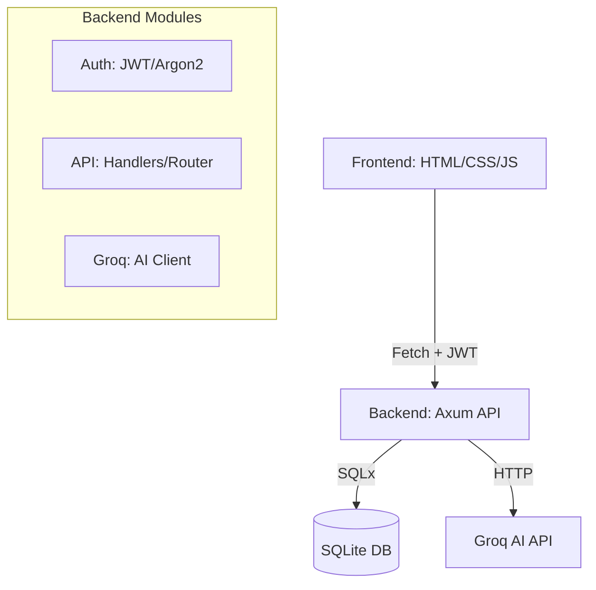

<div style="display: flex; justify-content: space-around;">
    <div style="width: 50%; padding: 10px;">
        
    </div>
    <div style="width: 50%; padding: 10px;">
            
    </div>
</div>


# 🤖 SaaS AI Personal Assistant

A production-ready SaaS web application built with **Rust (Axum)** and **SQLite**, integrated with **Groq LLM** for intelligent productivity and financial insights.


---

## 🦀 Why Rust?

Choosing Rust for this personal assistant SaaS provides several critical advantages:

- **Performance & Efficiency**: Rust delivers C/C++ level performance, ensuring the backend handles AI streaming and database queries with minimal latency and resource consumption.
- **Memory Safety**: Rust's ownership model eliminates common bugs like null pointer dereferences and buffer overflows, which is vital for a secure multi-tenant SaaS application.
- **Fearless Concurrency**: The `tokio` and `axum` ecosystem makes handling many concurrent user connections and asynchronous AI API calls efficient and safe.
- **Type Safety**: Strong compile-time checks ensure that API request/response structures are always valid, reducing runtime errors.
- **Modern Tooling**: Cargo provides a world-class build system and package manager, making dependency management and deployment seamless.

---

## ✨ Features

### 🌐 Modern Web Dashboard
- **Glassmorphism UI**: Beautiful dark-themed dashboard with responsive design.
- **Multi-Tenant**: Secure user registration and login with JWT authentication.
- **Real-time Updates**: Dynamic task and expense management without page reloads.

### 📋 Intelligent Task Management
- Create, track, and complete tasks.
- **AI Smart Suggestions**: Get AI-powered advice on what to focus on next based on your current workload.
- **AI Prioritization**: Automatically suggest priority order for pending tasks.

### 💰 Financial Tracking
- Categorized expense logging.
- **Spending Breakdown**: Visual percentage breakdown of spending by category.
- **AI Budget Insights**: Intelligent analysis and advice on your spending patterns.

### 💬 AI Conversational Chat
- Context-aware chat with memory.
- Ask the AI to analyze your tasks, suggest budget cuts, or general productivity tips.

---


## 🏗️ Architecture



---

## 🔧 Tech Stack

| Layer | Technology | Purpose |
|-------|------------|---------|
| **Backend** | `axum` | High-performance async web framework |
| **Database** | `sqlx` + SQLite | Async SQL with compile-time safety |
| **Auth** | `jsonwebtoken` + `argon2` | Secure sessions and password hashing |
| **Frontend** | Vanilla JS + Glassmorphism CSS | Fast, modern, and dependency-free UI |
| **AI** | `meta-llama/llama-4-maverick` | Groq-powered high-speed LLM |

---

## 🚀 Quick Start

### 1. Prerequisites
- Rust (Latest Stable)
- Groq API Key from [console.groq.com](https://console.groq.com)

### 2. Setup

```bash
# Clone the repository
git clone https://github.com/rehammetwally/personal_assistant.git
cd personal_assistant

# Configure environment
cp .env.example .env
# Edit .env and add your GROQ_API_KEY and JWT_SECRET
```

### 3. Run the Server

```bash
cargo run
```

The application will be available at: **`http://localhost:3000`**

---

## � Project Structure

```
.
├── src/
│   ├── main.rs         # Server entry & static file serving
│   ├── api/            # REST API handlers & routing
│   ├── auth.rs         # JWT & Password security
│   ├── db.rs           # SQLite & SQLx initialization
│   ├── groq.rs         # Groq AI implementation
│   └── models.rs       # Shared data structures
├── frontend/           # Modern Dashboard UI
│   ├── index.html
│   ├── styles.css
│   └── app.js
├── schema.sql          # DB Initialization script
└── .env                # Secret configuration
```

---

## � API Documentation

### Authentication
- `POST /api/auth/register` - Create account
- `POST /api/auth/login` - Get access token
- `GET /api/auth/me` - Current user info

### Task Operations (Protected)
- `GET /api/tasks` - List all tasks
- `POST /api/tasks` - Create new task
- `PATCH /api/tasks/:id` - Mark complete/edit
- `DELETE /api/tasks/:id` - Remove task

### Expense Operations (Protected)
- `GET /api/expenses` - List all expenses
- `POST /api/expenses` - Add expense
- `DELETE /api/expenses/:id` - Remove expense
- `GET /api/expenses/summary` - Get budget statistics

### AI Features (Protected)
- `POST /api/ai/suggest` - Get smart prompt
- `POST /api/ai/chat` - Message the AI

---

## 📝 Configuration

**.env file variables:**
```env
GROQ_API_KEY=your_key_here
GROQ_MODEL=meta-llama/llama-4-maverick-17b-128e-instruct
JWT_SECRET=your_long_random_secret_string
DATABASE_URL=sqlite:assistant.db
```

---

## �️ License

Distributed under the MIT License. See `LICENSE` for more information.

---
<p align="center">Built with 🦀 Rust and ⚡ Groq AI</p>
